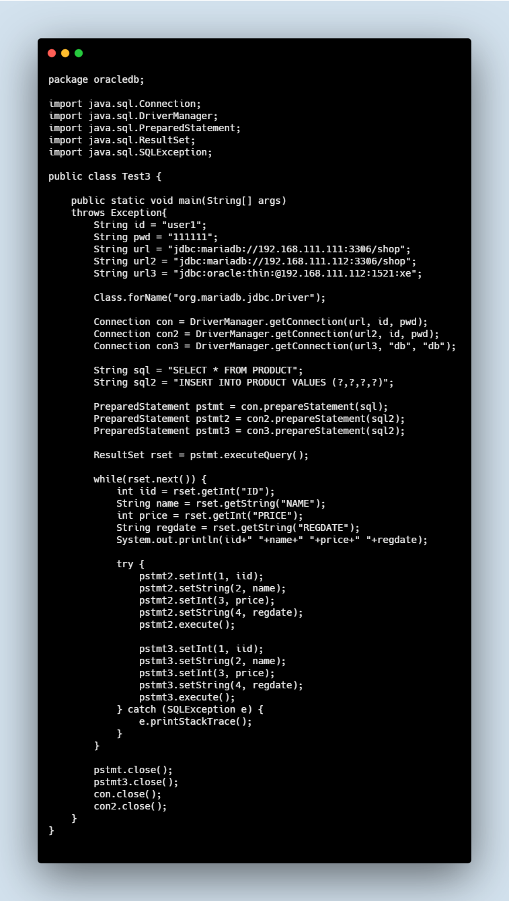

# Linux Workshop

## 0725

1. server2에 oracle과 mariadb를 설치한다.

2. server1의 mariadb에서 Product 데이터를 조회하여 조회한 데이터를

   server2의 oracle과 mariadb에 INSERT 하시오

<iframe
  src="https://carbon.now.sh/embed/?bg=rgba(171%2C%20184%2C%20195%2C%201)&t=3024-night&wt=none&l=text%2Fx-java&ds=true&dsyoff=20px&dsblur=68px&wc=true&wa=true&pv=56px&ph=56px&ln=false&fm=Hack&fs=14px&lh=133%25&si=false&es=2x&wm=false&code=package%2520oracledb%253B%250A%250Aimport%2520java.sql.Connection%253B%250Aimport%2520java.sql.DriverManager%253B%250Aimport%2520java.sql.PreparedStatement%253B%250Aimport%2520java.sql.ResultSet%253B%250Aimport%2520java.sql.SQLException%253B%250A%250Apublic%2520class%2520Test3%2520%257B%250A%250A%2509public%2520static%2520void%2520main(String%255B%255D%2520args)%2520%250A%2509throws%2520Exception%257B%250A%2509%2509String%2520id%2520%253D%2520%2522user1%2522%253B%250A%2509%2509String%2520pwd%2520%253D%2520%2522111111%2522%253B%250A%2509%2509String%2520url%2520%253D%2520%2522jdbc%253Amariadb%253A%252F%252F192.168.111.111%253A3306%252Fshop%2522%253B%250A%2509%2509String%2520url2%2520%253D%2520%2522jdbc%253Amariadb%253A%252F%252F192.168.111.112%253A3306%252Fshop%2522%253B%250A%2509%2509String%2520url3%2520%253D%2520%2522jdbc%253Aoracle%253Athin%253A%2540192.168.111.112%253A1521%253Axe%2522%253B%250A%2509%2509%250A%2509%2509Class.forName(%2522org.mariadb.jdbc.Driver%2522)%253B%250A%2509%2509%250A%2509%2509Connection%2520con%2520%253D%2520DriverManager.getConnection(url%252C%2520id%252C%2520pwd)%253B%250A%2509%2509Connection%2520con2%2520%253D%2520DriverManager.getConnection(url2%252C%2520id%252C%2520pwd)%253B%250A%2509%2509Connection%2520con3%2520%253D%2520DriverManager.getConnection(url3%252C%2520%2522db%2522%252C%2520%2522db%2522)%253B%250A%2509%2509%250A%2509%2509String%2520sql%2520%253D%2520%2522SELECT%2520*%2520FROM%2520PRODUCT%2522%253B%250A%2509%2509String%2520sql2%2520%253D%2520%2522INSERT%2520INTO%2520PRODUCT%2520VALUES%2520(%253F%252C%253F%252C%253F%252C%253F)%2522%253B%250A%2509%2509%250A%2509%2509PreparedStatement%2520pstmt%2520%253D%2520con.prepareStatement(sql)%253B%250A%2509%2509PreparedStatement%2520pstmt2%2520%253D%2520con2.prepareStatement(sql2)%253B%250A%2509%2509PreparedStatement%2520pstmt3%2520%253D%2520con3.prepareStatement(sql2)%253B%250A%2509%2509%250A%2509%2509ResultSet%2520rset%2520%253D%2520pstmt.executeQuery()%253B%250A%2509%2509%250A%2509%2509while(rset.next())%2520%257B%250A%2509%2509%2509int%2520iid%2520%253D%2520rset.getInt(%2522ID%2522)%253B%250A%2509%2509%2509String%2520name%2520%253D%2520rset.getString(%2522NAME%2522)%253B%250A%2509%2509%2509int%2520price%2520%253D%2520rset.getInt(%2522PRICE%2522)%253B%250A%2509%2509%2509String%2520regdate%2520%253D%2520rset.getString(%2522REGDATE%2522)%253B%250A%2509%2509%2509System.out.println(iid%252B%2522%2520%2522%252Bname%252B%2522%2520%2522%252Bprice%252B%2522%2520%2522%252Bregdate)%253B%250A%2509%2509%2509%250A%2509%2509%2509try%2520%257B%250A%2509%2509%2509%2509pstmt2.setInt(1%252C%2520iid)%253B%250A%2509%2509%2509%2509pstmt2.setString(2%252C%2520name)%253B%250A%2509%2509%2509%2509pstmt2.setInt(3%252C%2520price)%253B%250A%2509%2509%2509%2509pstmt2.setString(4%252C%2520regdate)%253B%250A%2509%2509%2509%2509pstmt2.execute()%253B%250A%2509%2509%2509%2509%250A%2509%2509%2509%2509pstmt3.setInt(1%252C%2520iid)%253B%250A%2509%2509%2509%2509pstmt3.setString(2%252C%2520name)%253B%250A%2509%2509%2509%2509pstmt3.setInt(3%252C%2520price)%253B%250A%2509%2509%2509%2509pstmt3.setString(4%252C%2520regdate)%253B%250A%2509%2509%2509%2509pstmt3.execute()%253B%250A%2509%2509%2509%257D%2520catch%2520(SQLException%2520e)%2520%257B%250A%2509%2509%2509%2509e.printStackTrace()%253B%250A%2509%2509%2509%257D%250A%2509%2509%257D%250A%2509%2509%250A%2509%2509pstmt.close()%253B%250A%2509%2509pstmt3.close()%253B%250A%2509%2509con.close()%253B%250A%2509%2509con2.close()%253B%250A%2509%257D%250A%257D%250A"
  style="transform:scale(0.7); width:1024px; height:473px; border:0; overflow:hidden;"
  sandbox="allow-scripts allow-same-origin">
</iframe>

