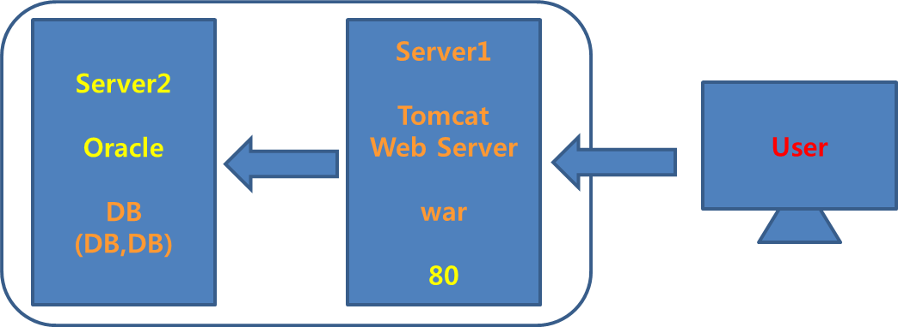

# Linux Workshop

## 0726

## 1




sport_0726.zip


##### Server2

http://192.168.111.112:8080/apex

SQL문 작성


##### Server1

```
[bin]# startup.sh => 톰캣 실행
[webapps]# cp ~/file/sport.war .
```


-------------------


## 2

#### MariaDB

1. ##### Query문 작성

- DDL

- DML - sequence

- Server2

  ```

  ```

  ​

  ```mariadb
  SELECT * FROM PLAYER ORDER BY ID ASC
  SELECT * FROM TEAM ORDER BY ID ASC
  SELECT * FROM P_HISTORY	ORDER BY ID ASC
  SELECT * FROM T_HISTORY	ORDER BY ID ASC

  CREATE TABLE U_LIST
  (
      ID       VARCHAR(20)    NOT NULL, 
      PWD      VARCHAR(20)    NULL, 
      NAME     VARCHAR(20)    NULL, 
      UMODE    DOUBLE          NULL
  );

  CREATE TABLE PLAYER
  (
      ID          DOUBLE          NOT NULL, 
      PIC         VARCHAR(20)    NULL, 
      NAME        NVARCHAR(20)    NULL, 
      POSITION    VARCHAR(20)    NULL, 
      TEAM        VARCHAR(20)    NULL
  );

  CREATE TABLE P_HISTORY
  (
      TEAM       VARCHAR(20)    NULL, 
      ERA        DOUBLE          NULL, 
      GAME       DOUBLE          NULL, 
      AVG        DOUBLE          NULL, 
      HR         DOUBLE          NULL, 
      YEAR       DOUBLE          NULL, 
      WPCT       DOUBLE          NULL, 
      BACKNUM    DOUBLE          NULL, 
      ID         DOUBLE          NULL
  );

  CREATE TABLE TEAM
  (
      TNAME       VARCHAR(20)    NULL, 
      HSTA        NVARCHAR(40)    NULL, 
      DIRECTOR    NVARCHAR(20)    NULL, 
      ID          DOUBLE          NULL, 
      VICTORY     DOUBLE          NULL
  );

  CREATE TABLE T_HISTORY
  (
      YEAR     DOUBLE          NULL, 
      TEAM     VARCHAR(20)    NULL, 
      GRADE    DOUBLE          NULL, 
      ID       DOUBLE          NULL, 
      WGAME    DOUBLE          NULL, 
      LGAME    DOUBLE          NULL, 
      TGAME    DOUBLE          NULL
  );

  INSERT INTO U_LIST VALUES('id01', 'pwd01', 'name01', 0);
  INSERT INTO U_LIST VALUES('id02', 'pwd02', 'name02', 1);

  INSERT INTO PLAYER VALUES(101, 'kt_50.jpg', '강백호', 'H', 'WIZ');
  INSERT INTO PLAYER VALUES(102, 'kt_43.jpg', '김민', 'P', 'WIZ');
  INSERT INTO PLAYER VALUES(103, 'kia_16.jpg', '김주찬', 'H', 'TIGERS');
  INSERT INTO PLAYER VALUES(104, 'kia_54.jpg', '양현종', 'P', 'TIGERS');
  INSERT INTO PLAYER VALUES(105, 'nc_25.jpg', '양의지', 'H', 'DINOS');

  INSERT INTO TEAM VALUES ('WIZ', '수원 KT WIZ 파크', '이강철', 1, 0);
  INSERT INTO TEAM VALUES('TIGERS','광주기아 챔피언스필드', '-', 2,11);
  INSERT INTO TEAM VALUES ('DINOS', '창원NC파크', '이동욱', 3, 0);

  INSERT INTO P_HISTORY VALUES ('WIZ', NULL, 138, 0.290, 29, 2018, NULL, 50, 101);
  INSERT INTO P_HISTORY VALUES ('WIZ', 5.06, 9, NULL, NULL, 2018, 0.667, 43, 102);
  INSERT INTO P_HISTORY VALUES ('TIGERS', NULL, 121, 0.340, 18, 2018, NULL, 16, 103);
  INSERT INTO P_HISTORY VALUES ('TIGERS', 4.15, 29, NULL, NULL, 2018, 0.542, 54, 104);
  INSERT INTO P_HISTORY VALUES ('DINOS', NULL, 133, 0.358, 23, 2018, NULL, 25, 105);

  INSERT INTO T_HISTORY VALUES (2018, 'WIZ', 9, 1, 59, 82, 3);
  INSERT INTO T_HISTORY VALUES (2018, 'TIGERS', 5, 2, 70, 74, 0);
  INSERT INTO T_HISTORY VALUES (2018, 'DINOS', 10, 3, 58, 85, 1);

  ```

  ​


2. ##### Spring MVC

- MariaDB JDBC 설치(pom.xml) - maven으로 가져올 수 있음

  ```xml
  		<!--  maria DB -->
  		<!-- https://mvnrepository.com/artifact/org.mariadb.jdbc/mariadb-java-client -->
  		<dependency>
   			<groupId>org.mariadb.jdbc</groupId>
      		<artifactId>mariadb-java-client</artifactId>
    			<version>2.4.2</version>
  		</dependency>
  ```

  ​

- Spring 환경설정 바꾸기(xml)

  ```xml
  <!-- 1. Database Setting -->
  	<bean id="dataSource"
  		class="org.springframework.jdbc.datasource.DriverManagerDataSource">
  		<property name="driverClassName"
  			value="org.mariadb.jdbc.Driver" />
  		<property name="url"
  			value="jdbc:mariadb://192.168.111.112:1521:3306/sport_agency" />
  		<property name="username" value="db" />
  		<property name="password" value="db" />
  	</bean>
  ```

  ​


3. ##### Mybatis Mapper 작업

- XML(~~mapper.xml) 수정


